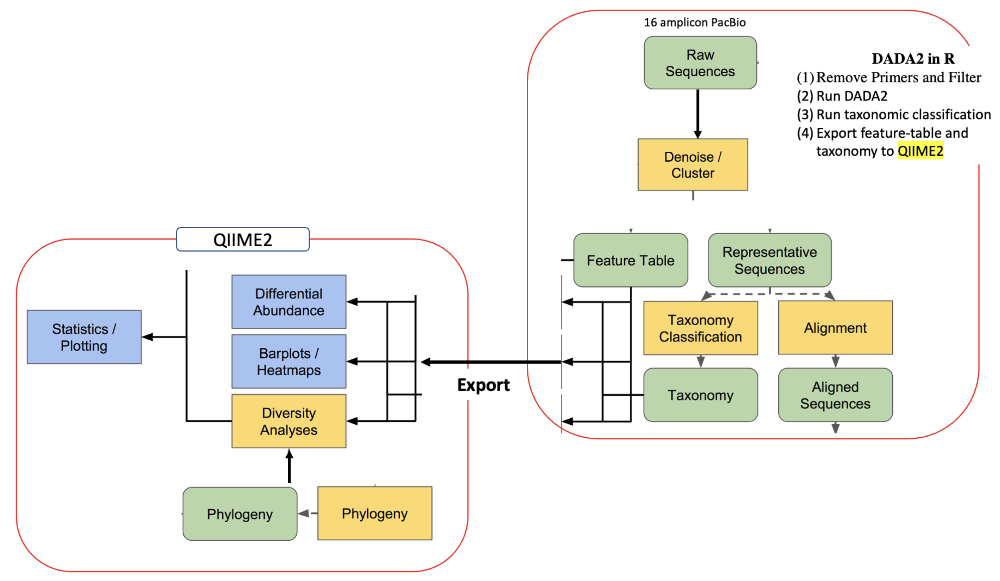
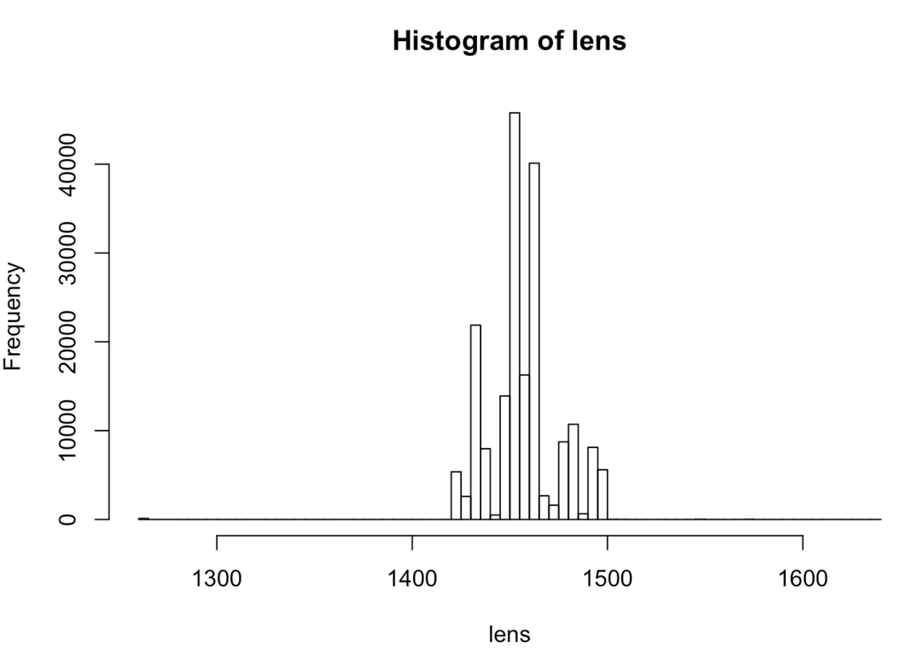

__Last updated__: `r Sys.Date()`

```{r, echo=FALSE}
library(knitr)
opts_chunk$set(fig.align = "center")
knitr::opts_chunk$set(fig.width=20, fig.height=8) 
```


# Description
SIH Project: [PIPE-2417](https://ctdshub.atlassian.net/secure/RapidBoard.jspa?rapidView=27&projectKey=PIPE&modal=detail&selectedIssue=PIPE-2417)


# People

__LCI:__ ???

__PhD candidate:__ Dr Giselle Cooke

__USyd Researcher__: Dr Joanna Harnett  


__SIH staff members__

* Tracy Chew (Nandan's group lead)
* Nandan Deshpande 

# Compute facilities

Artemis

Project: Sperm_quality

Directory: /project/RDS-FMH-Sperm_quality-RW/nandanDeshpande/PIPE-2417_Stallion_microbiome/


# PRIMARY REFERENCES

(1) DADA2 + PacBio: Fecal Samples
:https://benjjneb.github.io/LRASManuscript/LRASms_fecal.html

(2) A full example workflow for amplicon data
:https://astrobiomike.github.io/amplicon/dada2_workflow_ex

(3) Amplicon analysis
 :https://astrobiomike.github.io/amplicon/





# DADA2 in R
A workflow for recovering single-nucleotide resolved Amplicon Sequence Variants (ASVs) from amplicon data 
https://benjjneb.github.io/dada2/index.html

```{r}

module load R/4.0.4 (at unix prompt)


# The following script represents the R-script "run_DADA2inR.R"
# This is run as > Rscript run_DADA2inR.R 

#########################################################


# Load modules
library(dada2);packageVersion("dada2")
library(Biostrings); packageVersion("Biostrings")
library(ShortRead); packageVersion("ShortRead")
library(ggplot2); packageVersion("ggplot2")
library(reshape2); packageVersion("reshape2")
library(gridExtra); packageVersion("gridExtra")
library(phyloseq); packageVersion("phyloseq")

# SET paths

base_path="/project/RDS-FMH-Sperm_quality-RW/nandanDeshpande/PIPE-2417_Stallion_microbiome/intervention_study"
path2 <- base_path+"/data/raw_data_zipped"
path.out <- base_path+"analysis/approach_2_DADA2R_to_QIIME2_BenjaminCallahan/iteration_2_withChimeraRemoval/Figures"
path.rds <- base_path+"analysis/approach_2_DADA2R_to_QIIME2_BenjaminCallahan/iteration_2_withChimeraRemoval/RDS/"
```

# Remove primer seqeunces

Check the reference(s) for comparison between V3V4 And full-length sequencing Of 16S RRNA Genes 
https://help.ezbiocloud.net/comparison-between-v3v4-and-full-length-sequencing-of-16s-rrna-genes/
https://academic.oup.com/nar/article/47/18/e103/5527971

```{r}
# Read compressed fastq files 

fns2 <- list.files(path2, pattern="fastq.gz", full.names=TRUE)

# primers used for PacBio
F27 <- "AGRGTTYGATYMTGGCTCAG"
R1492 <- "RGYTACCTTGTTACGACTT"
rc <- dada2:::rc
theme_set(theme_bw())


nops2 <- file.path(path2, "noprimers", basename(fns2))
prim2 <- removePrimers(fns2, nops2, primer.fwd=F27, primer.rev=dada2:::rc(R1492), orient=TRUE)

print("DONE : Remove Primers")

```

# Inspect length distribution after primer removal
```{r}

lens.fn <- lapply(nops2, function(fn) nchar(getSequences(fn)))
lens <- do.call(c, lens.fn)

# Need to figure out why the image saving step is causing issues!
#jpeg(file="hist.jpeg")
#hist(lens, 100)
#dev.off()
```



# Filter (quality anbd length)
```{r}

filts2 <- file.path(path2, "noprimers", "filtered", basename(fns2))

track2 <- filterAndTrim(nops2, filts2, minQ=3, minLen=1000, maxLen=1600, maxN=0, rm.phix=FALSE, maxEE=2)
track2

```

# Run DADA2

## Dereplicate
derepFastq: Read in and dereplicate a fastq file.
Dereplication is a common step in many amplicon processing workflows. Instead of keeping 100 identical sequences and doing all downstream processing to all 100, you can keep/process one of them and just attach the number 100 to it. 
When DADA2 dereplicates sequences, it also generates a new quality-score profile of each unique sequence based on the average quality scores of each base of all of the sequences that were replicates of it.

```{r}
drp2 <- derepFastq(filts2, verbose=TRUE)
```

## Generate an error model
Generating our error model by learning the specific error-signature of our dataset. 
Each sequencing run, even when all goes well, will have its own subtle variations to its error profile. 
Error rates are learned by alternating between sample inference and error rate estimation until convergence. 
Sample inferences is performed by the dada function. 
Error rate estimation is performed by errorEstimationFunction. 
The output of this function serves as input to the dada function call as the err parameter.
Computationally intensive step

```{r}
err2 <- learnErrors(drp2, errorEstimationFunction=PacBioErrfun, BAND_SIZE=32, multithread=TRUE)

saveRDS(err2, file.path(path.rds, "Intervention_err2.rds"))

#Inspect errors: Again the image issue
#plotErrors(err2)

print("DONE : Learn errors")

```

## Infer ASVs

To infer true biological sequences. 
It does this by incorporating the consensus quality profiles and abundances of each unique sequence, and then figuring out if each sequence is more likely to be of biological origin or more likely to be spurious.
Also read about pseudo-pooling in case of very high number of samples (https://astrobiomike.github.io/amplicon/dada2_workflow_ex)
```{r}

dd2_step1 <- dada(drp2, err=err2, BAND_SIZE=32, multithread=TRUE)
              
#Save it for downstream analysis: Avoid re-processing upto this step.              
saveRDS(dd2, file.path(path.rds, "Intervention_dd2.rds"))           
              
print("DONE : Denoise")

#Read tracking:
cbind(ccs=prim2[,1], primers=prim2[,2], filtered=track2[,2], denoised=sapply(dd2, function(x) sum(x$denoised)))

####@@@ Generating an Amplicon sequence variant table (ASV) /  count table / biom table / OTU matrix
st2 <- makeSequenceTable(dd2); dim(st2)
dim(st2)
class(seqtab) # matrix
 
##Inspect distribution of sequence lengths
table(nchar(getSequences(st2)))


#The sequence table is a matrix with 
  # rows corresponding to (and named by) the samples, and 
  # columns corresponding to (and named by) the sequence variants.


```


#  Identify chimeras

This function is a wrapper around isBimera for collections of unique sequences (i.e. sequences with associated abundances). Each sequence is evaluated against a set of "parents" drawn from the sequence collection that are sufficiently more abundant than the sequence being evaluated. A logical vector is returned, with an entry for each input sequence indicating whether it was (was not) consistent with being a bimera of those more abundant "parents".
https://www.rdocumentation.org/packages/dada2/versions/1.0.3/topics/isBimeraDenovo

```{r}

bim2 <- isBimeraDenovo(st2, minFoldParentOverAbundance=3.5, multithread=TRUE)
table(bim2)

sum(st2[,bim2])/sum(st2)

#bim2
#FALSE  TRUE
#92187 10226
#[1] 0.04196494

# DADA2 identifies likely chimeras by aligning each sequence with those that were recovered in greater abundance and then seeing if there are any lower-abundance sequences that can be made exactly by mixing left and right portions of two of the more-abundant ones. These are then removed:

st2.nochim <- removeBimeraDenovo(st2, verbose=T)
```

# Assign taxonomy
The DADA2 package provides a native implementation of the naive Bayesian classifier method for this purpose. 
The assignTaxonomy function takes as input a set of sequences to be classified and a training set of reference sequences with known taxonomy, and outputs taxonomic assignments with at least minBoot bootstrap confidence.


## Using assignTaxonomy() function
```{r}

tax2 <- assignTaxonomy(st2.nochim, "/project/RDS-FMH-Sperm_quality-RW/nandanDeshpande/PIPE-2417_Stallion_microbiome/retrospective_study/BenjaminCallahan_approach/silva_nr_v128_train_set.fa.gz", multithread=TRUE) # Slowest part
tax2[,"Genus"] <- gsub("Escherichia/Shigella", "Escherichia", tax2[,"Genus"]) # Reformat to be compatible with other data sources
#head(unname(tax2))

```

## Also addSpecies() after assignTaxonomy()
```{r}
# The dada2 package also implements a method to make species level assignments based on exact matching between ASVs and sequenced reference strains. 
# Recent analysis suggests that exact matching (or 100% identity) is the only appropriate way to assign species to 16S gene fragments. 
# Currently, species-assignment training fastas are available for the Silva and RDP 16S databases. 
# To follow the optional species addition step, download the silva_species_assignment_v132.fa.gz file, and place it in the directory with the fastq files.

tax2_species_level <- addSpecies(tax2, "silva_species_assignment_v128.fa.gz")


# Extract sample names from the filenames:
sample.names2 <- sapply(strsplit(fns2, "/"), function(x) paste(x[9], sep=".fastq.gz"))
sample.names2 <- gsub(".fastq.gz", "", sample.names2)
rownames(st2) <- sample.names2
sample.names2


```


## Assign Taxonomy using DECIPHER
```{r}
# Downloading DECIPHER-formatted SILVA v138 reference
download.file(url="http://www2.decipher.codes/Classification/TrainingSets/SILVA_SSU_r138_2019.RData", destfile="SILVA_SSU_r138_2019.RData")

## Loading reference taxonomy object
load("SILVA_SSU_r138_2019.RData")

st2 <- readRDS(file.path(path.rds, "Intervention_tax2.nochim_Silva128.rds"))


#creating DNAStringSet object of our ASVs
dna <- DNAStringSet(getSequences(st2))

## and classifying
tax_info <- IdTaxa(test=dna, trainingSet=trainingSet, strand="both", processors=16)

#Also check the section Alternatives:
#https://benjjneb.github.io/dada2/tutorial.html

```

# Save processed objects for downstream analysis.
```{r}

# Since dada() and assignTaxonomy() commands are the most time consuming steps in this workflow, it is recommended that we save the results from these for downstream analysis. 

saveRDS(st2.nochim, file.path(path.rds, "Intervention_st2.nochim.rds"))

saveRDS(tax2, file.path(path.rds, "Intervention_tax2.nochim_Silva128.rds"))

saveRDS(tax2_species_level, file.path(path.rds, "Intervention_tax2_Silva128_withSpecies.rds"))

saveRDS(tax_info, file.path(path.rds, "Intervention_tax2.nochim_DECIPHER_Silva138.rds"))

#########################################################

```


Add a new chunk by clicking the *Insert Chunk* button on the toolbar or by pressing *Cmd+Option+I*.

When you save the notebook, an HTML file containing the code and output will be saved alongside it (click the *Preview* button or press *Cmd+Shift+K* to preview the HTML file). 

The preview shows you a rendered HTML copy of the contents of the editor. Consequently, unlike *Knit*, *Preview* does not run any R code chunks. Instead, the output of the chunk when it was last run in the editor is displayed.

